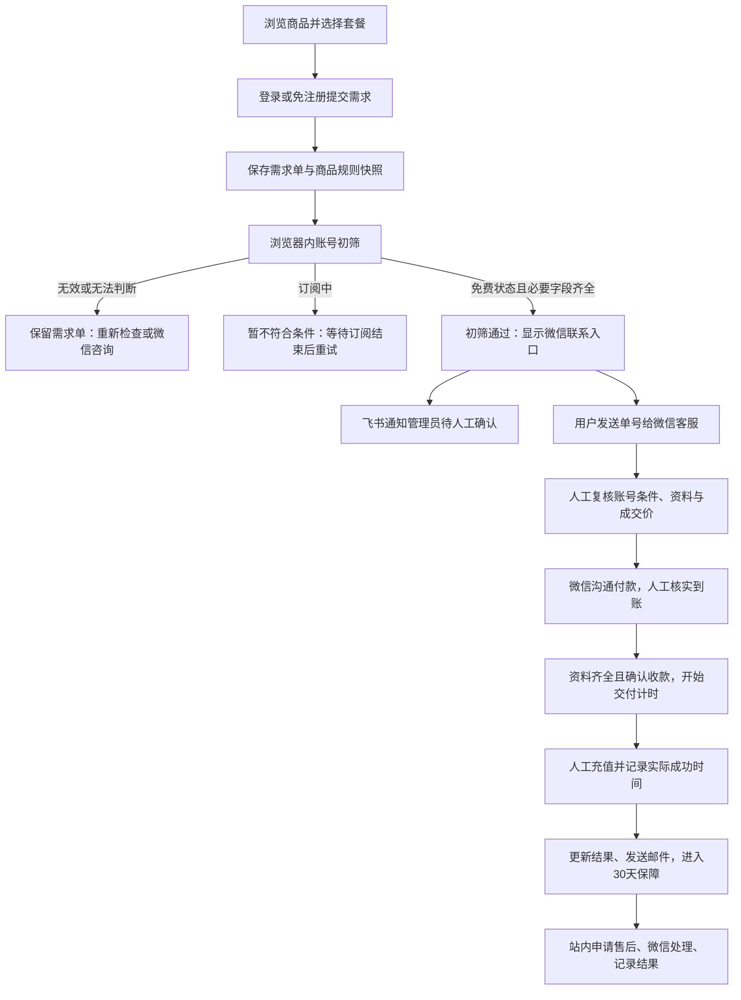

# ChongHub 人工充值服务站设计

日期：2026-09-20
状态：业务与视觉方向已在对话确认；本文待统一审阅。
工作边界：仅设计文档，不创建 Trellis 任务、不实现业务代码、不提交 Git。本文不构成开发或上线授权。

## 1. 产品定位与范围

面向拥有 ChatGPT 账号的用户，提供会员人工充值服务。网站承担商品展示、需求记录、账号初筛、进度查询和售后申请；客服在微信确认需求、报价与付款，并人工完成充值。

首版包含用户网站、单管理员后台和共享业务后端。后台面向多品类商品建模，但首版只发布下列 GPT 商品。其他品类可保留草稿，不在前台出现。

| 商品名称（沿用上游命名） | 周期 | 初始销售价 |
| --- | --- | ---: |
| ChatGPT Plus · 月卡 | 月卡 | ¥145.00 |
| ChatGPT Pro 5X · 月卡 | 月卡 | ¥750.00 |
| ChatGPT Pro 20X · 月卡 | 月卡 | ¥1,350.00 |

商品名称不等于对官方权益规格的独立验证。权益介绍应使用核实后的内容，不从生成效果图提取事实。

不纳入首版：Go 月卡、iOS 续订、Team 商品、Google 账号等其他品类销售、购物车、在线支付、自动续费、钱包余额、上游接口、自动发货、员工角色与派单。后续上游交付预期通过接口实现，本次不设计接口协议或库存系统。

## 2. 角色与访问边界

| 角色 | 能力 |
| --- | --- |
| 游客 | 浏览商品、提交需求、进行初筛、通过单号和查询密码查单、申请售后 |
| 注册用户 | 邮箱验证码登录、首次验证自动注册、集中查看本人订单和售后 |
| 管理员 | 管理商品、报价、收款、交付、售后、用户与网站设置 |

管理员为预先指定的单一账号，普通邮箱注册不会获得后台权限。后台每个接口都校验权限，不能只隐藏菜单。

联系邮箱不要求与 ChatGPT 邮箱相同。邮箱验证只证明控制该联系邮箱，不证明充值账号的所有权或充值资格。

用户验证联系邮箱后，可关联该邮箱下尚未绑定用户的游客需求单；不能覆盖其他账号已绑定的订单。注册和找回流程不向未验证者泄露邮箱是否存在、历史订单内容或数量。

## 3. 核心流程

需求单在初筛前即保存。重复点击提交应返回同一次提交的结果；重新初筛使用原单，不反复创建新单。未通过初筛仍可联系人工咨询，不引导付款。初筛通过不是接单、付款或交付承诺。

## 4. 用户端页面与交互

| 页面 | 内容与动作 |
| --- | --- |
| 首页 | 三个商品、售价、适用条件、人工流程、FAQ、服务时间、客服入口 |
| 商品详情 | 套餐选择、价格、当前无有效订阅的限制、交付时效、售后约定、提交需求 |
| 提交需求 | 联系邮箱、当前订阅情况、可选备注；游客另设查询密码；可切换验证码登录 |
| 账号初筛 | 登录与会话获取指引、粘贴框、初筛结果、重试和联系客服 |
| 提交成功／微信联系 | 单号、初筛结果、二维码、复制咨询文案、查看进度；明确未付款待人工确认 |
| 游客查单 | 单号＋查询密码；通过原联系邮箱验证重设查询密码 |
| 个人中心 | 本人订单、售后记录、账号信息 |
| 订单详情 | 商品快照、确认报价、收款与交付状态、时间线、预计交付时间、结果、微信和售后入口 |
| 售后申请与详情 | 问题类型、说明、可选截图、处理进度与结果，关联原订单 |
| 购买说明 | 账号条件、人工流程、服务时段、保障与退款规则 |
| 服务条款与隐私说明 | 服务边界、信息用途与处理方式；正式上线前按实际经营主体核定 |

提交按钮附近文案：

> 提交后生成需求单，请联系微信客服确认账号条件、价格和交付时间。本网站暂不提供在线支付。

游客与登录用户共用订单详情结构，采用不同访问验证。刷新与跨设备访问不得依赖浏览器临时状态作为唯一订单凭据。邮件不发送查询密码。

手机端重点：商品页底部提交入口；初筛通过后二维码放大与原图查看、长按保存说明、复制咨询内容；不承诺网页能一键打开指定微信好友。

## 5. ChatGPT 会话初筛

### 5.1 输入与隐私边界

入口：[ChatGPT](https://chatgpt.com/)；会话页面：`https://chatgpt.com/api/auth/session`。

用户自行登录后，在同一浏览器打开会话页面，并粘贴完整内容。页面说明这是含敏感凭证的会话数据，不是官方 OAuth 授权，不将它宣传成仅供查看订阅的授权文件。

**只在浏览器内解析，原始内容不上传、不保存、不用于调用任何账号接口。** 不进入后端请求、日志、飞书、邮件、埋点、错误上报、会话回放、URL、本地存储或自动保存表单。分析脚本不得采集该输入框。检查完成或离开页面时清空应用持有的原文；不能承诺清除操作系统剪贴板等应用控制范围以外的副本。

首版不提供服务端授权文件上传或凭证管理。人工充值所需资料另在微信确认交接，网站不保存充值凭证。

### 5.2 样例依据与分类

已只读检查用户提供的三个样例，未调用其中凭证。以下仅记录非敏感观察，不把原文件复制进仓库或测试资源。

| 样例 | 观察 | 处理 |
| --- | --- | --- |
| auth1.json | 仅 WARNING_BANNER，无用户、账号或令牌 | 未获取有效登录信息，展示登录和重新获取入口 |
| session.json | 必要字段存在，account.planType=prolite；用户确认订阅中 | 当前订阅中，暂不处理，等待结束后重试 |
| new_auth.json | 必要字段存在，account.planType=free；用户确认可充值 | 初步校验通过，引导微信人工确认 |

建议检查顺序：非空输入、合理大小限制、JSON 对象结构、必要字段、会话到期信息、套餐类型。必要字段存在并不证明令牌真实或有效。

- 明确已过期：要求重新获取；`expires` 仅作会话时间提示，不能用作会员到期时间。
- `free` 且必要字段齐全：初筛通过。
- 已确认的 `prolite`：显示订阅中。其他订阅类型需有验证依据后加入规则；不能用“不是 free 就必然订阅中”替代未知分支。
- 未知套餐、字段缺失或时间无法判断：无法判断，允许人工咨询，不自动通过。
- 格式错误：提示复制完整内容，不在错误消息中回显原文。

初筛无法证明实时订阅状态、曾经订阅历史、账号归属或上游充值资格，也无法防止用户篡改 JSON。所有状态均为不可信的客户端报告，不能驱动确认收款或完成交付。

通过文案：

> 初步校验通过。你提供的账号信息显示当前为免费状态，符合本套餐的初步受理条件。请添加客服微信，确认报价与人工交付。实际充值前客服会再次核实。

后端仅接收限定枚举的初筛结果、受限套餐标识和规则版本；记录服务端接收时间，标注“用户提交信息初筛”。不接收原文、令牌或从原文提取的个人信息。未来测试使用人工构造的虚拟样例。

## 6. 订单与状态

需求与人工成交使用同一订单记录，通过阶段区分，不为同一购买意向创建互不关联的两份业务单。

| 维度 | 状态 |
| --- | --- |
| 初筛 | 未检查、通过、订阅中、资料无效、无法判断 |
| 收款 | 未收款、已收款、部分退款、已退款 |
| 交付 | 待确认、待处理、待补充信息、处理中、已完成、已取消 |
| 售后 | 待处理、处理中、待用户回复、已解决、已关闭 |

收款、交付、初筛和售后独立存储，但应约束组合：

- 客户提交截图或点击按钮不能自行变为已收款。
- 只有管理员核实实际到账后才能登记收款；不能重复登记同一笔交易。
- 开始交付要求人工确认可受理、成交价明确、收款已确认、所需资料齐全。
- 完成必须填写交付结果和实际充值成功时间，后者作为保障起点。
- 已收款订单取消时保留退款待办，不能用取消掩盖待退资金。
- 售后不会删除或覆盖原交付历史。
- 内部备注与用户可见消息是不同字段；前台接口不得返回内部备注、上游成本和操作敏感信息。

用户未联系微信时保留待确认。首版不预设无人确认的自动取消期限。网络错误重试、重复回调式动作或双击不得重复建单、记款、退款或发送重复待办。

## 7. 价格与商品管理

各套餐的销售价由后台独立编辑，前台从后端读取。此前“约加价15%”只保留为可选计算建议，用户已确认的三个售价优先，不按该比例强制重算。

后台可维护：上游参考价及核对时间、可选实际采购成本、建议加价比例、建议售价、最终销售价。手动点击计算并确认后才采用建议价；上游页面变化不会自动影响前台。

订单保存商品名称、套餐、展示价格、适用条件、时效与售后规则的快照。微信确认成交价独立记录；已确认订单改价需重新与用户确认并留痕。金额按人民币分保存，避免浮点误差。

商品编辑分为基本信息、套餐规格、购买条件、交付售后、发布设置。支持分类、封面、简介、排序、预览、草稿、上架、下架；套餐也能独立停售。下架不影响历史订单访问。

购买前检查按商品配置，不能让未来所有品类都强制 GPT 会话初筛。首版交付方式只有人工，尚未实现的自动交付不可作为可发布选项。

上游链接、成本、供应商备注限后台使用。前台服务描述改为本站实际的人工服务，不沿用上游秒发、自动发卡或未经核实的营销数据。

## 8. 服务时间与交付时效

营业时段：每日北京时间（Asia/Shanghai）09:30–23:00。资料齐全且确认收款后，在累计两个营业小时内完成交付；非营业时间暂停计时，次日顺延。

| 条件满足时间 | 最迟交付时间 |
| --- | --- |
| 当日 10:00 | 当日 12:00 |
| 当日 22:30 | 次日 11:00 |
| 当日 23:30 | 次日 11:30 |

开始时点取实际收款确认与资料齐全两个条件均满足的时点。已有时效不能因管理员反复切换状态而重新计时。资料后续变化、上游故障或超时，应标记异常并沟通，不静默延长已展示承诺。

后台与用户订单页展示同一个预计最晚完成时间。修改营业时间和时效只作用于后续适用订单，保留既有承诺与规则快照。节假日例外排班不纳入首版默认规则；临时停业可暂停商品接单并发布说明。

## 9. 订阅保障与退款

经用户确认，参照上游采用30天订阅保障，期间掉订阅按剩余时长退赔，账号封禁不在该订阅保障范围内。

本站明确的计算规则：

`建议退款金额 = 用户实付金额 × 经核实的剩余保障时长 ÷ 30天`

- 保障从实际充值成功时间起算；30天按连续自然时间计算，不受营业时间限制。
- 以经人工核实的掉订阅时间计算剩余时间，避免客服处理延迟减少赔付。
- 剩余时间限制在0至30天内，金额四舍五入到分；累计退款不超过用户实付。
- 例如实付¥145、剩余15天，则建议退款¥72.50。
- 同一事件重复申请不得重复退款；已有退款需在可退余额中扣除。
- 先计算建议额，由管理员核实并登记线下实际退款，网站不发起转账。
- 用户退款和向上游取得的赔付分开记录。

售后申请包含问题类型、描述和可选截图。提醒遮挡敏感信息；附件仅订单有权访问者和管理员可见。文件类型、大小及访问控制必须校验，不使用公共可枚举链接。

30天规则不自动回答未交付取消、充值彻底失败等其他争议。设计建议此类订单由管理员核实实际未履约部分并人工处理，不擅自对外新增不可退款条款。正式服务条款需在上线前结合实际经营主体核定。

## 10. 管理后台与手机操作

五个主要入口：

1. 工作台：待确认、待交付、待补充信息、售后待办、超时订单、通知失败提醒。
2. 商品管理：创建、编辑、规格价格、预览和上下架。
3. 订单管理：按单号、邮箱、商品、状态查询；报价、收款、交付、售后、退款、操作历史。
4. 用户管理：注册用户与关联订单；游客资料在相应订单中查看。
5. 网站设置：客服资料、二维码、营业时间、说明文本、管理员邮箱、邮件与飞书通知配置。

订单详情按客户需求、报价与收款、交付、售后排列。手机端以待办卡片与关键操作为主，支持复制单号及沟通文案；商品长文和图片整理主要面向电脑。

登记收款、退款、完成交付等动作展示核对信息后确认，记录操作者、时间、变更前后值。用服务端并发检查避免手机和电脑同时修改时相互覆盖。单管理员仍需操作审计。

## 11. 客服与通知

客服昵称：流风。用户提供的微信标识：`wxid_7ccixhrr9gtk22`。该标识的可搜索性未验证，默认优先二维码；复制微信号按钮在验证后启用。

二维码资产见 [客服二维码原图](assets/customer-service-wechat.jpg)。保留原图，不重新生成或重绘二维码；后台可更换。尚未验证扫码成功，不将图片存在等同于识别验证。

联系页面展示单号、所选套餐、二维码和可复制文案，例如：

> 你好，我想咨询 ChatGPT Plus 月卡，需求单号为 CH-示例单号，已完成账号初筛，请帮我确认充值条件和交付时间。

邮件用途：验证码、需求单摘要与查询入口、重要进度、售后结果。邮件不包含查询密码、会话内容或充值凭证。

飞书发往指定群：初筛通过的新需求、站内补充信息、售后申请。通知提供摘要和后台入口，不携带会话内容或完整个人资料。点击后仍需后台身份验证。未完成或未通过初筛的需求仍可后台查看，默认不逐条发送飞书。

订单保存与通知发送解耦：先保存业务状态及待发送事件，再异步发送；失败可重试、后台可查看。使用事件标识去重；不能因为邮件或飞书故障丢单或回滚交付。具体飞书群配置、邮件发件域名在部署阶段完成，本轮不配置或发送真实消息。

## 12. 技术边界与数据责任

推荐一个业务后端、一套数据库，服务用户网站和后台；不拆微服务。具体框架、数据库产品、邮件服务商及部署环境未在本轮选定，留给实施规划，不将其伪装成已确认决策。

主要逻辑实体：商品、套餐、用户、订单与快照、初筛报告、报价记录、收款与退款记录、交付事件、售后与私有附件、通知事件、网站设置、审计记录。

网站后端是订单事实来源；微信用于沟通，飞书用于提醒，二者不是订单状态的权威账本。

身份和访问要求：验证码有时效、发送限频、尝试次数限制及单次使用约束；游客查询密码安全散列保存，查询限频且避免泄露单号存在性；登录会话受保护；后台写操作有防跨站请求与权限校验。凭据、飞书密钥及邮件密钥不公开返回给前台或写入日志。

## 13. 已确认视觉方向与参考稿

用户确认浅色背景、深色文字、青绿色主按钮的专业充值服务站方向。后台深色侧栏，移动端清晰待办和大触控区域。

| 参考稿 | 覆盖 |
| --- | --- |
| [前台总览](assets/01-public.png) | 首页、商品详情、需求提交、购买说明 |
| [用户内页](assets/02-account.png) | 登录、初筛、微信引导、查单、个人中心、订单售后 |
| [后台总览](assets/03-admin.png) | 工作台、商品管理与编辑、订单、用户、设置 |
| [手机端](assets/04-mobile.png) | 前台关键页面、手机工作台及订单处理 |

这些是 imagegen 生成的布局与风格参考，不是实现截图。图中的Team、长周期套餐、旧价格、示例日期、营业时间、网址、售后文字及假二维码不构成业务需求。正式设计以本文为准，替换为三个确认商品、真实售价、09:30–23:00、营业时段2小时与真实客服二维码。删除未经证实的销量、评价和官方身份暗示。

## 14. 异常处理与验收标准

以下为未来实现的验收约束，不代表已实现或测试通过。

- [ ] 前台只展示已上架商品与套餐，三个初始售价正确；后台改价后新需求使用新价，旧单快照不变。
- [ ] 游客无需登录即可提交、初筛、查单及申请售后；错误凭据无法读取他人订单。
- [ ] 邮箱验证码登录能创建账号，归并订单必须先验证邮箱且不抢占已绑定订单。
- [ ] 三个合成初筛样例分别进入登录指引、订阅中、初筛通过；未知、错误和过期内容不误报通过。
- [ ] 检查浏览器网络、存储、日志和遥测，确认原始会话内容从未上传或持久保存；客户端篡改通过状态不能触发交付。
- [ ] 提交重试不重复建单；后台重复点击不重复记款、退款或通知。
- [ ] 商品详情和订单页均说明人工确认、无在线付款，未付款不会被展示为支付成功。
- [ ] 收款与资料条件满足后按营业时段计时，覆盖22:30、23:30、跨日、边界09:30及23:00案例。
- [ ] 已承诺交付时间不因刷新、状态切换或设置修改而被静默重置；超时明确可见。
- [ ] 保障从实际充值成功起算，按实付和核实剩余时长计算退款；处理延迟不减少赔付，累计退款不超实付。
- [ ] 游客/普通用户不能访问后台、内部备注、成本或他人附件。
- [ ] 邮件或飞书故障不丢单，重试有记录且去重；群消息中无敏感凭证。
- [ ] 手机可完成查单、微信联系、核款、更新进度与售后处理；关键确认不会被遮挡或横向溢出。
- [ ] 真实二维码上线前在手机验证识别；微信标识验证前不宣称可搜索添加。
- [ ] 使用已批准的视觉方向，修正生成稿中的事实与文案偏差。

## 15. 实施前准备，不阻塞本轮设计审阅

已确认业务规则与设计边界均在本文列出。以下属于后续实施或上线输入：实际经营主体及条款、正式品牌域名、邮件发件服务和域名认证、管理员邮箱、飞书群与机器人配置、各套餐经核实的权益描述、采购成本、技术栈与部署环境、客服二维码识别及微信号可搜索性验证。

上线前还需确定业务记录与售后附件的保留期限及删除规则；不得据此延长保存原始会话内容，后者首版始终不上传、不保存。

## 16. 参考与确认来源

- 用户在本会话逐项确认的商品价格、人工服务、账号初筛边界、客服资料、时效、售后及视觉方向为本站设计依据。
- [参考站商品中心](https://gpt.jedeeai.com/products)：已浏览核对商品名称及标价，仅作参考，不实时同步。
- [参考站购买须知](https://gpt.jedeeai.com/blog/buy-guide)：已核对30天订阅保障、剩余天数退赔和账号封禁除外说明。
- 本站以用户实付金额、实际充值成功时间和连续剩余时长作为退款计算口径，是用户明确确认的本站规则，不冒称为上游原文。
